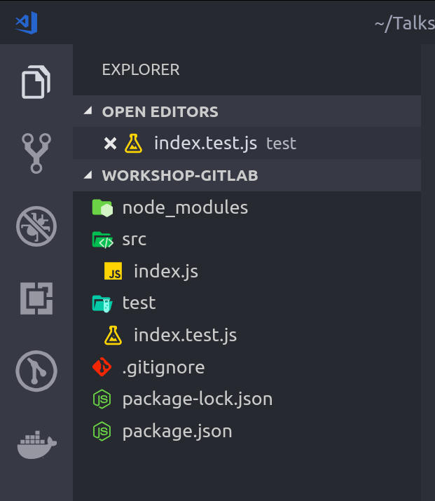

# Node.js: Testes

Escrevemos testes automatizados para garantir que nossa aplicação está funcionando como o esperado sem precisar testar manualmente antes de cada release.

Existem diversos tipos de testes, como os unitários e de integração.

Em um processo de DevOps é muito comum subir um container ou máquina virtual para testar nosso código a cada push no Git, dessa forma garantindo que não estamos enviando código com erros conhecidos para o servidor.

Existem diversas ferramentas de testes para JavaScript/Node.js, uma das mais famosas hoje em dia é o [Jest](https://jestjs.io/), desenvolvido por uma equipe do Facebook com diversos contribuidores, para instalarmos o Jest no nosso projeto, rode o seguinte comando no Terminal:

```
npm install jest --save-dev
```

Isso dirá ao npm (gerenciador de pacotes que já vem instalado com o Node.js) para instalar o Jest no diretório atual, criando a pasta _node_modules_ que é a padrão para dependências locais do Node.js. Utilizamos o `--save-dev` para indicar que usaremos essa dependência apenas no ambiente de desenvolvido, pois não é algo que usaremos apenas no processo de desenvolvimento e não chegará ao nosso usuário final.

Em seguida crie uma pasta chamada _tests_ na raiz do seu projeto, e então crie um arquivo chamado _index.test.js_, em seguida cole o código a seguir:

```javascript
// tests/index.test.js

const file = require('../src/index');

describe('Testes da função soma', () => {
  it('deve resultar em 3 ao executar a função soma', () => {
    expect(file.soma(1, 2)).toBe(3);
  });

  it('o resultado deve ser maior que 5', () => {
    expect(file.soma(7, 8)).toBeGreaterThan(5);
  });
});

describe('Testes da função subtrai', () => {
  it('deve resultar em 2 ao executar a função subtrai', () => {
    expect(file.subtrai(4, 2)).toBe(2);
  });
});
```

Essa é a forma mais comum de se testar código em JavaScript, as palavras-chave são:

- **require**: Indica ao Node.js que você está requisitando informações de outro arquivo, no caso ele pegará os dados que você colocou no `module.exports` do _src/index.js_, que seriam as funções `soma` e `subtrai`, dessa forma você consegue executá-las em outros arquivos.
- **describe**: Indica o nome da sessão de testes, nessa colocamos uma sequência de testes que tem algo em comum, como por exemplo executar a mesma função, ideal para ter um código mais organizado.
- **it**: Indica o início de um teste, com a descrição do mesmo seguida de uma função a ser executada com o que deve ser testado.
- **expect**: Função em que você passa o valor a ser testado.
- **toBe\***: Função onde fará o teste, existem várias funções de `.toBe()`, a mais basica significa que você espera que tal valor seja igual a outro, porém existem outras como o `.toBeGreaterThan(n)`, que você espera que o valor passado dentro do expect seja maior que n, você pode ver uma lista de `.toBe()` [clicando aqui](https://jestjs.io/docs/en/expect#methods).

Na maioria das linguagens de programação a forma de escrever testes automatizados não fogem muito dos métodos indicados acima, mudando apenas um pouco na nomenclatura ou sintaxe.

Ao final, nossa estrutura de projeto ficará mais ou menos assim:



Para executar nossos testes com o Jest, mude o conteúdo da propriedade `"test"` dentro de `"scripts"` do arquivo _package.json_ de `"echo \"Error: no test specified\" && exit 1"` para simplesmente "jest", deixando ele mais ou menos assim:

```javascript
{
  "name": "workshop-gitlab",
  "version": "1.0.0",
  "description": "",
  "main": "index.js",
  "scripts": {
    "test": "jest"
  },
  "keywords": [],
  "author": "",
  "license": "ISC",
  "devDependencies": {	
    "jest": "^24.1.0"	
  }
}
```
